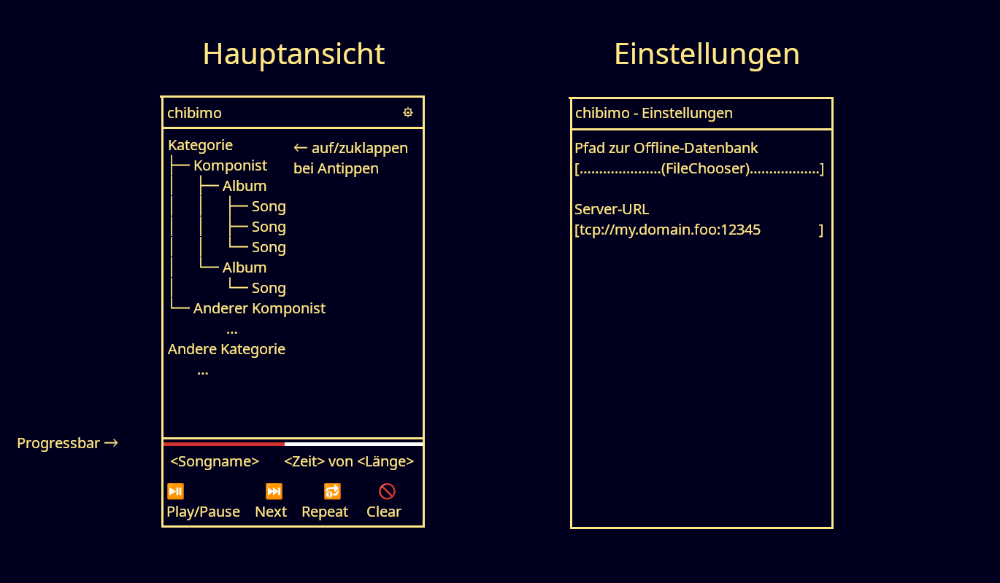

# ちびも - chibimo
### Der erste emo-Client für Android
[emo](https://github.com/42LoCo42/emo2) ist ein von mir entwickeltes Tool
zur Verwaltung einer persönlichen Musikbibliothek.
Sein Hauptteil ist ein in [Nim](https://nim-lang.org/) geschriebener Server.
Dieser spricht ein einfaches zeilenorientiertes Protokoll,
mit dem Clients Songs in eine globale Playlist einfügen,
diese auslesen,
und sich sogar Songvorschläge vom Server geben lassen können,
die an das bisherige Hörverhalten angepasst werden.

Bisher existiert nur ein Client für emo,
geschrieben in Bash und gedacht für den Einsatz auf Linux-PCs.
Mit chibimo möchte ich nun einen Client für Android bauen.

Die wichtigsten Funktionen sollen sein:

- Hierarchisch organisierte Musikauswahl (z.B. Komponist → Album → Song)
- Wiedergabe im Hintergrund
- Optionaler Offline-Modus,
bei dem Statistik-Daten erst später mit dem Server synchronisiert werden

Der Name "chibimo" ist ein Portmanteau aus dem japanischen Wort "chibi",
welches "klein" bedeutet,
und der verlautsprachlichten Umschreibung "imo" anstelle von emo.

# Ungefähres Layout

# Weitere Details
Die App wird in Kotlin geschrieben sein.
Geforderte Fähigkeiten sind:

- Netzwerkkommunikation
- Komplexes Layouting (für hierarchische Auswahl)
- Interaktion zwischen Service und MediaPlayer
- Benutzung der persistenten Android-Settings
- Automatische Analyse der Konnektivität
zwecks Wechsel zum Offline-Modus
- Lokale Datenbank zur Datenspeicherung im Offline-Modus

Das Projekt wird auf [GitHub](https://github.com/42LoCo42/chibimo)
unter der GNU Affero GPL v3.0 zur Verfügung gestellt.
